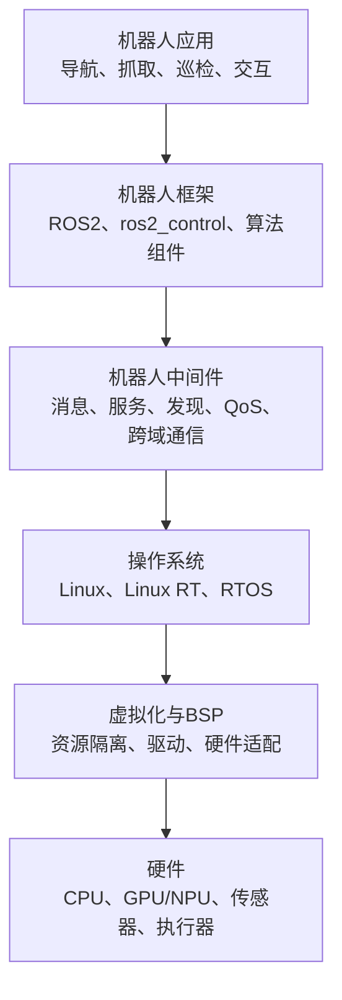

# 操作系统、ROS与中间件是什么

> 文档版本：v1.1_20260828
> 适合读者：听说过Linux或ROS，但不了解它们之间关系的人

## 1. 先看它们处在什么位置

这几个概念相互配合，但职责不同。

## 2. 操作系统是什么

操作系统负责管理硬件资源，并为应用提供基本运行环境。常见能力包括进程和线程调度、内存管理、设备驱动、文件系统、网络、安全和日志。

机器人中常见两类操作系统：

- **Linux**：生态丰富，适合AI、视觉、导航、应用管理和开发工具。
- **RTOS**：强调任务在规定时间内完成，适合周期控制、现场总线和设备管理。

Linux也可以通过实时补丁和系统配置形成Linux RT，用于比普通Linux更强调实时性的场景。但“平均速度快”不等于“实时性好”，实时系统更关注最坏情况下的延迟和抖动。

## 3. ROS是什么

ROS是Robot Operating System的缩写，但它通常不是Linux、Windows或RTOS意义上的操作系统内核。

更准确地说，ROS是一套机器人软件框架和生态，提供：

- 节点化的软件组织方式；
- Topic、Service和Action等通信模型；
- 坐标变换、数据记录、可视化和调试工具；
- 导航、控制、感知等大量可复用软件包；
- 机器人开发社区形成的接口和使用习惯。

ROS通常运行在Linux等操作系统之上。ROS2还通过RMW抽象层对接DDS等通信实现。

## 4. 中间件是什么

中间件位于应用和操作系统之间，帮助不同进程、不同设备或不同功能域交换数据。

它需要解决的不只是“把数据发出去”，还包括：

- 对方在哪里以及怎样发现对方；
- 数据是一对一发送还是发布给多个订阅者；
- 数据丢失后是否需要重发；
- 控制指令和相机数据谁优先；
- 不同系统、处理器和网络之间怎样兼容；
- 如何观察延迟、带宽、丢包和异常状态。

DDS、Zenoh、共享内存、RPC和ROS2 RMW都与这层能力有关，但它们解决的问题和适用范围并不完全相同。

## 5. 现场总线是什么

现场总线连接控制器与驱动器、编码器、I/O模块等设备。EtherCAT、AUTBUS和CAN等技术常用于机器人设备通信。

机器人中间件更多负责应用、进程和功能域之间的数据协同；现场总线更接近设备侧的周期通信。二者需要衔接，但不应被当作同一层技术。

## 6. 一个简单类比

| 技术 | 类比 | 实际职责 |
| --- | --- | --- |
| 操作系统 | 城市基础设施 | 管理计算、存储、设备和运行秩序 |
| ROS | 机器人开发社区的通用工作方式 | 提供框架、接口、工具和软件生态 |
| 中间件 | 信息传输与协调系统 | 让应用和功能域可靠交换数据 |
| 现场总线 | 通往执行设备的专用线路 | 周期性连接电机、编码器和I/O |
| 机器人应用 | 具体业务 | 完成导航、抓取、巡检等任务 |

## 7. 与鸿道的关系

鸿道机器人操作系统提供Linux、Linux RT、RTOS及虚拟化运行基础；ROS2和AGIROS等框架承载机器人应用生态；DDS、共享内存、虚拟网络和现场总线等能力连接不同功能域和设备。

它们组合在一起，才形成可开发、可运行和可验证的机器人软件平台。

上一篇：[机器人场景入门](01-机器人场景入门.md)
下一篇：[鸿道机器人操作系统介绍](03-鸿道机器人操作系统介绍.md)

