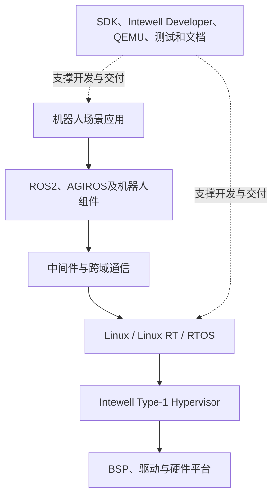

# 鸿道机器人操作系统介绍

> 文档状态：第一版草稿  
> 能力口径：具体支持范围以正式发布版本为准

## 1. 一句话介绍

鸿道机器人操作系统是一套面向具身机器人的多域融合基础软件平台，让智控、运动控制和通信主站等不同实时等级的应用，能够独立可靠运行并按需要在统一计算平台上协同。

## 2. 产品服务谁

| 用户 | 主要工作 | 希望获得的结果 |
| --- | --- | --- |
| 机器人厂商和系统架构师 | 设计整机计算与控制架构 | 减少系统复杂度，形成稳定产品构型 |
| AI和应用开发者 | 开发感知、规划和任务应用 | 获得Linux、AI框架和机器人生态环境 |
| 运动控制工程师 | 开发步态、轨迹和平衡控制 | 获得稳定的实时运行和调试环境 |
| 总线和设备工程师 | 连接驱动器、编码器和I/O | 获得主站协议、驱动和周期通信能力 |
| 集成、测试与交付人员 | 安装、部署、验证和定位问题 | 获得统一版本、工具、文档和测试证据 |

## 3. 为什么需要这个产品

机器人系统常由多块控制器、多个操作系统和多套工具链组成。随着AI模型、传感器和关节数量增加，系统可能面临：

- 板卡、线束、功耗和整机成本增加；
- 不同功能域之间通信链路较长；
- AI负载可能影响运动控制任务；
- 系统版本、配置和问题定位方式不统一；
- 针对不同芯片和客户重复适配。

鸿道从底层计算架构出发，通过虚拟化、实时操作系统、跨域通信和统一开发工具处理这些问题。

## 4. 产品由什么组成

产品不只是一个系统镜像。可交付的平台还需要包含SDK、工具链、示例、安装说明、开发文档、兼容性信息和测试证据。

## 5. 核心价值

### 多域融合

智控、运控和通信主站可以根据硬件、成本、实时性和安全需求组合部署，减少对固定多控制器架构的依赖。

### 实时与隔离

通过虚拟化和实时系统，为不同任务分配CPU、内存、中断和外设资源，降低相互干扰并限制故障扩散。

### 跨域通信

通过DDS、虚拟网络、共享内存和现场总线等机制传递任务、控制和状态数据，缩短功能域之间的协同链路。

### 统一开发体验

通过SDK和Intewell Developer支持工程创建、编译、部署、运行和调试，并结合QEMU与真实目标板完成不同阶段的验证。

### 平台适配与复用

围绕不同芯片和板卡沉淀BSP、驱动、配置、兼容性和测试资产，减少项目之间的重复工作。

## 6. 产品边界

鸿道提供机器人应用的运行底座、通信能力和开发环境，但不等于机器人整机，也不替代所有上层算法。

| 鸿道提供 | 通常由合作伙伴或应用团队提供 |
| --- | --- |
| 操作系统、虚拟化、BSP和驱动基础 | 机器人机械结构和整机设计 |
| 实时运行环境和资源隔离 | 具体步态、抓取和业务算法 |
| 中间件和跨域通信机制 | 面向具体任务训练的AI模型 |
| SDK、开发工具和调试能力 | 客户专属应用和工艺流程 |
| 发布、测试和兼容性基础 | 最终整机安全设计与场景验收 |

## 7. 当前状态表达

- **当前能力**：已形成单域运行、操作系统、BSP、SDK和基础工具等产品基础。
- **开发验证中**：两域、三域融合及跨域通信能力正在不同平台上持续开发和验证。
- **演进构想**：面向开发、运维和机器人任务的Agent能力将逐步融入平台。

本文只说明产品方向。具体平台、组件版本和性能指标，应以正式发布包、兼容性矩阵和测试报告为准。

上一篇：[操作系统、ROS与中间件是什么](02-操作系统-ROS与中间件是什么.md)  
下一篇：[鸿道三域融合架构](04-鸿道三域融合架构.md)

