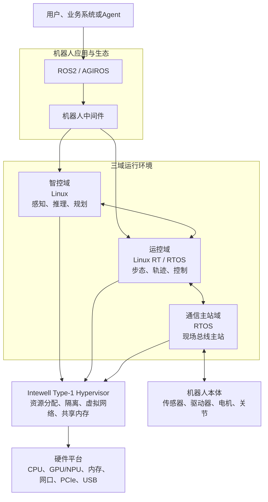

# 鸿道三域融合架构

> 文档状态：第一版草稿  
> 说明：三域是逻辑职责，具体部署方式由产品版本和硬件构型决定

## 1. 为什么需要多域

机器人同时运行AI推理、运动控制和设备通信任务。这些任务具有不同特点：

- AI推理需要较强算力和丰富的软件生态；
- 运动控制需要稳定周期和可预测的时延；
- 设备通信需要与驱动器、编码器和I/O保持确定性连接。

把所有任务无差别地放在同一个通用系统中，可能产生资源争用；把所有任务固定拆到不同控制器上，又会增加硬件和通信复杂度。

鸿道采用多域架构，让不同任务拥有合适的运行环境，并通过虚拟化和中间件完成隔离与协同。

## 2. 三域分别做什么

### 智控域

智控域负责理解环境和任务目标，典型能力包括：

- 接入相机、激光雷达、语音等数据；
- 运行视觉、语音和大模型等AI能力；
- 完成定位、建图、目标识别和任务规划；
- 运行ROS2、AGIROS及机器人应用。

智控域通常采用Linux环境，以获得AI框架、驱动和应用生态。

### 运控域

运控域把任务目标转换成机器人可以执行的连续运动，典型能力包括：

- 运行步态、平衡、轨迹和关节控制算法；
- 按固定周期执行控制任务；
- 处理关节状态和传感器反馈；
- 在异常时执行减速、停止或降级策略。

运控域可根据平台和算法需要采用Linux RT或RTOS。

### 通信主站域

通信主站域负责连接机器人设备，典型能力包括：

- 运行EtherCAT、AUTBUS等主站能力；
- 管理驱动器、编码器、I/O和其他从站；
- 周期发送控制指令并接收设备状态；
- 完成时钟同步和通信异常处理。

通信主站域通常采用RTOS，以满足周期通信要求。

## 3. 整体架构

## 4. Hypervisor解决什么问题

Type-1 Hypervisor直接运行在硬件平台之上，为多个运行环境提供：

- CPU、内存、中断和外设资源分配；
- 多操作系统同时启动和运行；
- 不同功能域之间的资源边界；
- 虚拟网络和共享内存等跨域通道；
- 面向不同硬件的单域、两域或三域构型。

融合不等于取消边界。系统设计的重点是：该共享的通信能够高效共享，该隔离的资源仍然严格隔离。

## 5. 一条任务怎样经过三个域

以行走抓取任务为例：

1. 智控域识别目标并生成路线和抓取目标。
2. 运控域把目标转换为身体、腿部和手臂的连续轨迹。
3. 通信主站域按周期把关节指令发送给驱动器。
4. 设备状态沿相反方向返回运控域和智控域。
5. 各域根据反馈继续计算和修正。

数据设计时必须明确来源、所有者、更新周期、传输路径、优先级和异常处理责任。

## 6. 实时性和安全边界

三域融合不能只看平均性能。正式方案需要验证：

- 控制周期内的最大延迟和抖动；
- 跨域通信的时延、带宽和尾延迟；
- 高负载下不同域之间的资源干扰；
- 单域故障是否会扩散到其他域；
- 通信异常时的降级、停止和恢复行为；
- 真实目标板上的驱动、总线、功耗和长时间稳定性。

QEMU适合早期开发和自动化回归，但不能替代真实硬件上的实时、设备和安全验证。

上一篇：[鸿道机器人操作系统介绍](03-鸿道机器人操作系统介绍.md)  
下一篇：[机器人中间件与通信](05-机器人中间件与通信.md)

