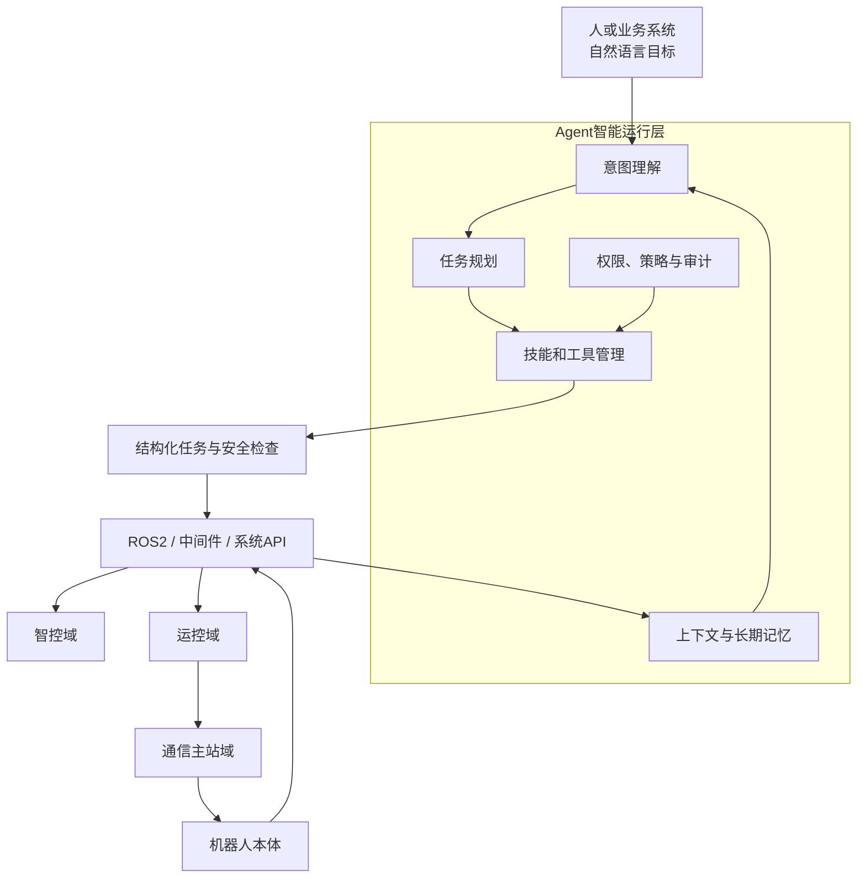

# Agent与鸿道机器人操作系统

> 文档状态：第一版草稿  
> 能力状态：以演进构想为主，部分开发和工具能力正在设计验证

## 1. 为什么要把Agent引入机器人操作系统

传统机器人应用通常由工程师预先编写程序和规则。用户只能在系统已经定义好的范围内操作机器人。

Agent带来的变化是：用户可以描述目标，系统理解目标、拆解任务、选择工具，并根据环境反馈调整执行过程。

例如，用户说“检查仓库三号区域，把异常设备拍照并生成报告”，Agent可以把它拆成导航、观察、拍照、记录和汇报等步骤，再调用机器人已有能力完成任务。

## 2. AIOS提供了什么启发

论文《LLM as OS, Agents as Apps》提出一种AIOS设想：把LLM类比为内核，把Agent类比为应用，把上下文和外部知识类比为内存与文件，把工具类比为设备或软件库，并使用自然语言作为交互和编程接口。

论文链接：<https://arxiv.org/abs/2312.03815>

这个思想有助于设计Agent运行时，但机器人系统不能把这种类比直接当成传统操作系统实现。LLM输出具有不确定性，而机器人会对真实物理世界产生动作。

鸿道更适合采用“传统OS底座 + Agent智能运行层”的分层方式。

## 3. 鸿道中的Agent分层

传统操作系统、Hypervisor和RTOS继续管理CPU、内存、设备、实时调度和隔离；Agent负责理解目标、规划任务、选择技能和调用受控接口。

## 4. 三类Agent

### 开发Agent

面向开发者，辅助完成：

- 根据需求创建工程和配置；
- 生成或修改应用代码；
- 调用编译、静态检查和测试工具；
- 在QEMU或目标板上部署和验证；
- 分析构建错误和运行日志。

### 运维Agent

面向测试和运维人员，辅助完成：

- 检查系统和应用状态；
- 聚合日志和诊断信息；
- 分析性能异常和通信故障；
- 按审批策略执行部署、恢复或回滚；
- 生成测试和运行报告。

### 机器人任务Agent

面向最终用户或业务系统，负责：

- 理解自然语言任务；
- 根据机器人状态选择可用技能；
- 把目标转换为结构化任务计划；
- 调用导航、识别、抓取等ROS2 Action或服务；
- 根据结果重新规划或请求人工介入。

## 5. Agent怎样调用机器人能力

建议把机器人能力封装成有明确输入、输出和约束的“技能”。

例如，“移动到目标点”技能应说明：

- 输入：目标位置、速度限制和避障策略；
- 前置条件：定位有效、地图可用、底盘正常；
- 输出：成功、失败、取消或超时；
- 权限：是否需要人工确认；
- 安全约束：禁行区、最大速度和急停状态；
- 实现接口：对应的ROS2 Action或系统服务。

Agent不能只根据一段提示词直接向电机发送控制数值。自然语言计划应先转换为结构化任务，再经过权限和安全检查，最后调用经过验证的确定性能力。

## 6. Agent的实时与安全边界

| 任务 | Agent可以参与 | 不应交给LLM直接执行 |
| --- | --- | --- |
| 理解人的目标 | 是 | - |
| 任务拆解和技能选择 | 是 | - |
| 导航或抓取任务编排 | 是，通过受控接口 | 绕过状态检查直接控制设备 |
| 运动轨迹生成 | 可以给出目标或候选方案 | 直接替代高频实时控制器 |
| 电机周期控制 | 只观察状态和设置上层目标 | 直接进入毫秒或更短周期闭环 |
| 急停和安全保护 | 可以解释原因和辅助恢复 | 决定是否忽略硬安全信号 |

核心原则是：

> 让Agent成为鸿道操作系统的智能运行层，但不让具有不确定性的LLM直接进入硬实时控制闭环。

## 7. Agent运行时需要哪些系统能力

第一阶段可优先建设：

- 统一任务入口和任务状态机；
- 技能注册、版本和依赖管理；
- 上下文、长期记忆和机器人状态快照；
- 工具调用权限和能力策略；
- 隔离执行、资源预算和超时取消；
- 操作审计、结果回传和失败恢复；
- ROS2、中间件、开发工具和系统管理接口。

CLI、Dashboard、SDK、Webhook、定时任务和IDE协议可以作为不同入口，但所有入口最终应进入统一的身份校验、任务治理和隔离执行流程。

## 8. 能力状态

- **当前基础**：鸿道已具备操作系统、虚拟化、中间件、开发工具和机器人生态等Agent运行所需的部分基础。
- **开发验证中**：通用Agent任务入口、运行时、工具管理和隔离机制正在形成设计与实现方案。
- **演进构想**：面向机器人任务的技能体系、多Agent协同和自然语言开发模式。

AgentOS的正式产品范围需要通过版本需求、接口定义、演示场景和安全评审逐步冻结。

上一篇：[机器人中间件与通信](05-机器人中间件与通信.md)  
下一篇：[鸿道机器人操作系统的发展过程](07-鸿道机器人操作系统的发展过程.md)

