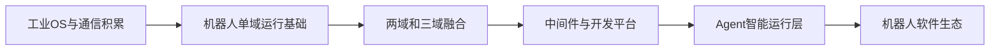

# 鸿道机器人操作系统的发展过程

> 文档状态：第一版草稿  
> 说明：本文描述产品演进逻辑，不替代正式版本路线图

## 1. 产品从哪里出发

鸿道机器人操作系统并不是从一张空白架构图开始。它建立在工业操作系统、实时控制、虚拟化和工业通信等长期技术积累之上。

工业控制与机器人有很多共同要求：设备需要长期稳定运行，关键任务必须按时完成，系统故障不能无限扩散，软硬件版本需要可追踪，现场问题还必须能够诊断和恢复。

机器人又带来了新的挑战：AI算力更强，软件生态更开放，传感器和数据更多，整机形态变化更快。产品需要把工业系统的实时、可靠和隔离能力，与机器人领域的AI、ROS和开发生态结合起来。

## 2. 第一阶段：形成单域运行基础

产品首先需要解决“一个功能域能否在目标硬件上可靠运行”。

这一阶段的主要工作包括：

- 适配芯片、板卡、启动流程、BSP和驱动；
- 建立Linux智控环境或RTOS实时控制环境；
- 提供SDK、工具链、示例和基础文档；
- 完成安装、启动、运行、调试和恢复闭环。

单域能力看起来不如融合架构醒目，却是后续所有能力的基础。没有可重复安装和验证的单域基线，多域融合只会放大版本和集成问题。

## 3. 第二阶段：从单域走向多域融合

当不同功能域分别具备运行基础后，产品开始处理“多个系统怎样在统一硬件上稳定协同”。

这一阶段引入Type-1 Hypervisor，重点解决：

- 多操作系统启动和生命周期管理；
- CPU、内存、中断和设备分配；
- 不同域之间的资源隔离；
- 虚拟网络和共享内存通信；
- 两域或三域产品构型；
- 高负载、故障和长时间运行验证。

产品形态由单域逐步发展到运控与通信融合，再进一步探索智控、运控和通信主站三域融合。

## 4. 第三阶段：从系统工程走向产品平台

能够启动多个系统，不代表客户已经能够使用产品。平台化阶段需要补齐：

- 统一SDK和工程模板；
- 应用创建、编译、部署和远程调试；
- QEMU早期开发和真实目标板验证；
- ROS2、AGIROS及中间件适配；
- 示例、手册、兼容性矩阵和软件BOM；
- 自动化测试、发布说明和问题诊断。

这个阶段的目标，是把“项目中能运行的工程能力”变成“能够重复交付和复用的产品能力”。

## 5. 第四阶段：形成Agent智能运行层

面向未来，鸿道计划在传统操作系统和机器人平台能力之上增加Agent智能运行层。

Agent将首先进入三个方向：

1. 辅助开发者生成、编译、部署和测试应用；
2. 辅助测试和运维人员诊断、恢复和管理系统；
3. 把人的自然语言目标转换为可验证的机器人任务和技能调用。

这一步不是用LLM替代操作系统内核或实时控制器，而是让Agent使用操作系统提供的资源、工具和安全机制，以受约束的方式组织更复杂的工作。

## 6. 演进主线

这条路线的核心没有变化：先把底层资源、实时控制和设备通信做稳定，再逐步提高系统融合度、开发效率和智能化程度。

## 7. 怎样记录真实的发展历史

后续版本应为每个关键节点补充以下事实：

| 字段 | 需要记录的内容 |
| --- | --- |
| 时间 | 立项、版本、发布或验证日期 |
| 问题 | 当时最需要解决的用户或系统问题 |
| 选择 | 团队做出的架构和产品决策 |
| 结果 | 形成的系统、工具、接口或交付物 |
| 证据 | 版本包、演示、测试报告或公开材料 |
| 影响 | 对后续产品路线产生了什么影响 |

公开文档只记录经过确认、允许公开的节点。客户名称、未发布计划、目标值和内部问题不应直接写入。

上一篇：[Agent与鸿道机器人操作系统](06-Agent与鸿道机器人操作系统.md)  
下一篇：[行业技术路线与代表产品](08-行业技术路线与代表产品.md)

